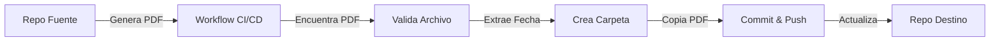

# 📂 Todas Mis Aplicaciones

Repositorio centralizado para almacenar y organizar hojas de vida (CVs) generadas automáticamente desde aplicaciones laborales.

## 📋 Descripción

Este repositorio recibe automáticamente archivos PDF de hojas de vida desde el repositorio privado `aplicaciones_laborales` mediante un workflow CI/CD configurado con GitHub Actions.

Los archivos se organizan por fecha de aplicación laboral en carpetas con formato `YYYY-MM-DD`, facilitando el seguimiento y la auditoría de cada aplicación.

## 🗂️ Estructura del Repositorio

```
todas-mis-aplicaciones/
├── .github/
│   └── workflows/
│       ├── receive-cv-from-aplicaciones-laborales.yml  # Workflow receptor
│       └── TEMPLATE-copy-cv-from-source.yml            # Plantilla para repo fuente
├── aplicaciones/
│   ├── 2025-01-15/
│   │   ├── cv_nombre.pdf      # Hoja de vida generada
│   │   └── README.md          # Metadata de la aplicación
│   ├── 2025-01-20/
│   │   ├── cv_nombre.pdf
│   │   └── README.md
│   └── ...
├── README.md                   # Este archivo
├── README-WORKFLOW.md          # Documentación detallada del workflow
├── QUICKSTART.md              # Guía rápida de configuración
└── .gitignore
```

## 🚀 Inicio Rápido

### Para Usuarios

Si solo quieres ver las hojas de vida almacenadas:

1. Ve a la carpeta [`aplicaciones/`](./aplicaciones/)
2. Busca la carpeta con la fecha de interés (formato: `YYYY-MM-DD`)
3. Descarga o visualiza el PDF de la hoja de vida

### Para Configuración

Si necesitas configurar el workflow CI/CD:

1. **Lectura rápida**: [QUICKSTART.md](./QUICKSTART.md) (5 minutos)
2. **Documentación completa**: [README-WORKFLOW.md](./README-WORKFLOW.md)

## ✨ Características

### 🔄 Automatización Completa

- ✅ Copia automática de PDFs generados
- ✅ Organización por fecha de aplicación
- ✅ Creación automática de carpetas
- ✅ Generación de metadata (README por aplicación)

### 🔐 Seguridad

- ✅ Autenticación mediante Personal Access Token (PAT)
- ✅ Tokens almacenados en GitHub Secrets
- ✅ Validación de archivos antes de copiar
- ✅ Verificación de integridad (MD5 checksum)

### 📊 Auditoría y Trazabilidad

- ✅ Logs detallados en cada ejecución
- ✅ Metadata completa por aplicación
- ✅ Referencias a workflow y commit de origen
- ✅ Resumen visual en GitHub Actions

### 🛡️ Prevención de Errores

- ✅ Detección de archivos duplicados
- ✅ Backup automático antes de sobrescribir
- ✅ Validación de formato de fecha
- ✅ Validación de formato PDF
- ✅ Reintentos automáticos en caso de fallo

## 📖 Documentación

| Documento | Descripción |
|-----------|-------------|
| [README.md](./README.md) | Descripción general del repositorio (este archivo) |
| [QUICKSTART.md](./QUICKSTART.md) | Guía rápida para configurar el workflow (5 min) |
| [README-WORKFLOW.md](./README-WORKFLOW.md) | Documentación técnica completa del workflow CI/CD |
| [aplicaciones/README.md](./aplicaciones/README.md) | Información sobre la estructura de carpetas |

## 🔧 Tecnologías Utilizadas

- **GitHub Actions**: Automatización del workflow CI/CD
- **GitHub Secrets**: Almacenamiento seguro de tokens
- **Git**: Control de versiones
- **Bash**: Scripts de automatización
- **Markdown**: Documentación

## 📅 Convenciones

### Formato de Fechas

Todas las fechas usan el formato **ISO 8601**: `YYYY-MM-DD`

Ejemplos:
- ✅ `2025-01-15`
- ✅ `2025-12-31`
- ❌ `15-01-2025`
- ❌ `2025/01/15`

### Nombres de Archivos PDF

Se recomienda usar nombres descriptivos:
- `cv_nombre_apellido.pdf`
- `hoja_de_vida_empresa.pdf`
- `resume_fecha.pdf`

El workflow detecta automáticamente archivos que contengan:
- `cv`
- `hoja_de_vida`
- `curriculum`
- `resume`

## 🔄 Flujo de Trabajo



### Proceso Detallado

1. **Generación**: Se genera un PDF de hoja de vida en `aplicaciones_laborales`
2. **Detección**: El workflow detecta la finalización exitosa
3. **Búsqueda**: Encuentra el archivo PDF más reciente
4. **Validación**: Verifica formato, tamaño e integridad
5. **Extracción de fecha**: Obtiene fecha del nombre del archivo o usa la actual
6. **Creación de carpeta**: Crea `aplicaciones/YYYY-MM-DD/` si no existe
7. **Copia**: Transfiere el PDF al repositorio destino
8. **Metadata**: Genera README con información de la aplicación
9. **Commit**: Guarda cambios con mensaje descriptivo
10. **Push**: Envía cambios al repositorio público
11. **Logs**: Genera resumen de la ejecución

## 🆘 Soporte

### Problemas Comunes

| Problema | Solución |
|----------|----------|
| No se encuentra el PDF | Verifica el patrón de búsqueda en el workflow |
| Error de permisos | Revisa que el PAT token esté configurado y no haya expirado |
| Fecha incorrecta | Asegúrate de usar formato `YYYY-MM-DD` |
| Push falla | Verifica permisos del token y estado del repo destino |

Para más detalles, consulta la sección de **Diagnóstico y Solución de Problemas** en [README-WORKFLOW.md](./README-WORKFLOW.md#-diagnóstico-y-solución-de-problemas).

### Logs

Todos los workflows generan logs detallados:

1. Ve a [Actions](https://github.com/angra8410/todas-mis-aplicaciones/actions)
2. Selecciona la ejecución de interés
3. Revisa los logs paso a paso

Los logs incluyen emojis para facilitar la lectura:
- ✅ Operación exitosa
- ❌ Error
- ⚠️ Advertencia
- 📄 Archivo/documento
- 📁 Carpeta
- 🔍 Búsqueda
- ⬆️ Push/Upload

## 📊 Estadísticas

El repositorio mantiene un registro de:
- Número total de aplicaciones laborales
- Fechas de aplicación
- Archivos generados
- Historial de cambios

## 🤝 Contribuciones

Este es un repositorio personal, pero si tienes sugerencias:

1. Abre un [Issue](https://github.com/angra8410/todas-mis-aplicaciones/issues)
2. Describe el problema o mejora
3. Propón una solución si es posible

## 📄 Licencia

Este proyecto es de uso personal.

## 🔗 Enlaces Relacionados

- [Repositorio Fuente: aplicaciones_laborales](https://github.com/angra8410/aplicaciones_laborales) (privado)
- [GitHub Actions Documentation](https://docs.github.com/en/actions)
- [Personal Access Tokens](https://docs.github.com/en/authentication/keeping-your-account-and-data-secure/creating-a-personal-access-token)

---

**Última actualización**: 2025-10-15

Para comenzar, consulta [QUICKSTART.md](./QUICKSTART.md) 🚀
